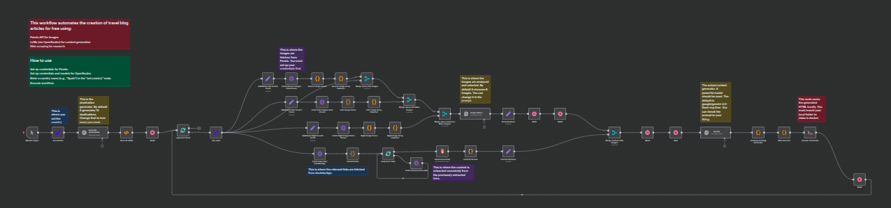

# n8n Travel Blog Generator 🌍

This workflow automates the creation of travel blog articles for free using:
- **Pexels API** for images
- **LLMs** (via OpenRouter) for content generation
- **Web scraping** for research

## How to Use
1. Import `Travel_Blog_Maker.json` into n8n.
2. Set up credentials for Pexels.
3. Set up credentials and models for OpenRouter.
4. Trigger with a country name (e.g., "Spain").

> **Notes**: This workflow is set up for local self-hosted instances. 
Customize the AI prompts in the "OpenAI" node for different writing styles. 
The wait nodes are necessary for openrouter's API call limitations.
It takes 15-20 minutes per article if using openrouter free models.
